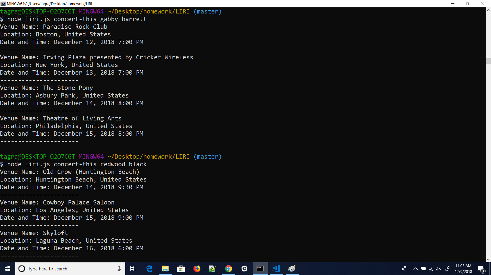
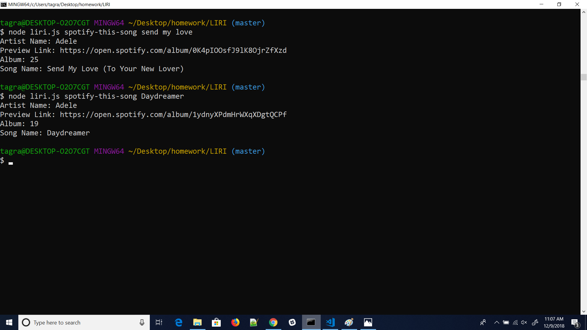
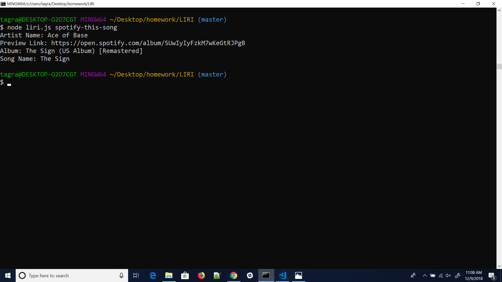

# LIRI
## LIRI Bot

### About
LIRI is a *Language* Interpretation and Recognition Interface. LIRI will be a command line node app that takes in parameters and gives you back data.

### What it does

#### Concert

`node liri.js concert-this <artist/band name here>`

This will show the following information about the each event in your terminal/bash window
* Name of the venue
* Venue location
* Date of the Event

#### Spotify

`node liri.js spotify-this-song '<song name here>'`

This will show the following information about the song in your terminal/bash window
* Artist(s)
* The song's name
* A preview link of the song from Spotify
* The album that the song is from

If no song is provided then your program will default to "The Sign" by Ace of Base.

#### Movies

`node liri.js movie-this '<movie name here>'`

This will show the following information about the movie in your terminal/bash window
* Title of the movie
* Year the movie came out
* IMDB Rating of the movie
* Rotten Tomatoes Rating of the movie
* Country where the movie was produced
* Language of the movie
* Plot of the movie
* Actors in the movie

If the user doesn't type a movie in, the program will output data for the movie 'Mr. Nobody.'

#### Do What It Says

`node liri.js do-what-it-says`

Right now it will run `spotify-this-song` for "I Want it That Way,".

Feel free to change the text in random.txt to test out the feature for other commands.